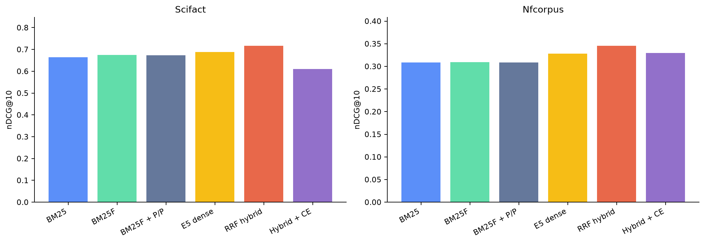

# Lexical, Dense & Hybrid Information Retrieval Research Framework

> **Post-Course Independent Retrieval Research Extension — 2026**

This repository has two deliberately separate parts:

1. **Part I — MSc Information Retrieval Coursework (Team Project):** the preserved historical BM25F/TREC Robust04 system and its original reported results.
2. **Part II — Independent Post-Course Retrieval Research Extension:** a new public-benchmark framework for lexical, dense, hybrid and neural reranking experiments.

The central research question is:

> **When does modern semantic retrieval genuinely improve on a strong lexical engine, and what does it cost in latency, complexity and interpretability?**

## Attribution boundary

| Work | Date/context | Attribution |
|---|---|---|
| Original TREC/BM25F implementation and Robust04 evaluation | ECS736P/U Information Retrieval — Coursework 2 | **Blazej Olszta, Muhamad Husaam Ateeq, Max Monaghan, Sulaiman Bhatti** |
| Independent public-benchmark extension | Post-course research, 2026 | **Muhamad Husaam Ateeq** |

The later work was not part of the submitted coursework. It does not reassign team authorship or retrospectively replace the historical implementation/results.

---

## Part I — MSc Information Retrieval Coursework (Team Project)

### Preserved system

The original project built a real field-aware search engine over licensed TREC Disk 4 & 5 / Robust04 material:

- collection-specific SGML parsing;
- shared lowercasing, stopword removal and Porter stemming;
- chunked positional SPIMI-style indexing;
- title/body BM25F;
- phrase and proximity bonuses;
- controlled WordNet synonym expansion;
- 249 Robust04 topics;
- MAP, P@10, nDCG@10, Recall@100 and R-Precision;
- Streamlit GUI and CLI; and
- a historical neural reranking attempt.

The original ranking, indexing, expansion and evaluation source files remain recognisable and unmodified by the extension.

### Historical Robust04 results

These are the team-project values preserved from the coursework README. They were **not rerun or corrected in 2026**.

| Historical coursework system | MAP | P@10 | nDCG@10 | Recall@100 | R-Precision |
|---|---:|---:|---:|---:|---:|
| BM25 Flattened (baseline) | 0.1832 | 0.3843 | 0.3852 | 0.3777 | 0.2509 |
| BM25 Separate Fields (unweighted) | 0.1603 | 0.3631 | 0.3685 | 0.3418 | 0.2273 |
| BM25F (field-weighted) | 0.1865 | 0.4012 | 0.3997 | 0.3804 | 0.2528 |
| BM25F + Phrase & Proximity | **0.1961** | **0.4040** | **0.4033** | **0.3938** | 0.2655 |
| BM25F + Phrase/Prox + WordNet | 0.1958 | 0.4040 | 0.4014 | 0.3936 | **0.2657** |
| BM25F + Phrase/Prox + WordNet + Neural Rerank | 0.1795 | 0.3795 | 0.3794 | 0.3936 | 0.2449 |

The phrase/proximity stage was the strongest historical improvement. WordNet was close to neutral on MAP. The neural reranker degraded MAP; that failure is preserved rather than hidden.

### Historical reproducibility status

TREC Disk 4 & 5, topics, qrels, sample indexes and result CSVs are not committed because the source data is licensed. The historical table is therefore preserved evidence, not a newly reproduced run. The audit also identifies material issues in the committed snapshot, including an undefined snippet-length setting, a missing reranker module, capped field statistics and depth-100 AP.

- [Historical coursework summary](reports/historical_coursework_summary.md)
- [Verbatim coursework README archive](reports/archive/README_coursework_164f8e.md)
- [Original system audit](reports/original_system_audit.md)

No TREC content is fabricated, reconstructed or downloaded by the extension.

---

## Part II — Independent Post-Course Retrieval Research Extension

### Public, frozen protocol

The new framework runs on two public BEIR-format benchmarks:

| Benchmark | Role | Documents | Test queries | Test judgments |
|---|---|---:|---:|---:|
| SciFact | primary scientific claim retrieval | 5,183 | 300 | 339 |
| NFCorpus | nutrition/medical generalisation | 3,633 | 323 | 12,334 |

SciFact’s 809-query train split alone selects lexical settings. The same frozen configuration is used on both tests. NFCorpus train/dev is not used. Exact archive hashes, split counts, model commits and the complete train grid are recorded in [frozen_protocol.json](research_extension/frozen_protocol.json).

### Controlled ladder

1. Standard BM25
2. Field-aware BM25F
3. BM25F + active phrase/proximity
4. E5-small-v2 dense retrieval
5. Lexical+dense Reciprocal Rank Fusion
6. Hybrid + fixed-depth cross-encoder reranking

Additional reranking diagnostics compare lexical, dense and hybrid candidate sources at the same depth 50.

### Models and engineering choices

- Dense encoder: [intfloat/e5-small-v2](https://huggingface.co/intfloat/e5-small-v2), pinned revision ffb93f3bd4047442299a41ebb6fa998a38507c52.
- 384 dimensions; query/passage prefixes; title/body boundary; maximum 512 tokens.
- L2-normalised dot product and exact NumPy search.
- Fusion: RRF with fixed k=60, avoiding lexical/dense score calibration.
- Cross-encoder: [cross-encoder/ms-marco-MiniLM-L2-v2](https://huggingface.co/cross-encoder/ms-marco-MiniLM-L2-v2), pinned revision 1b5cd67b15209f24824c50370e0397743aa9b787.
- Rerank depth: fixed at 50; candidate IDs cannot be introduced or removed.
- No neural model is fine-tuned on final test queries.

### Headline public-benchmark results

#### SciFact

| System | MAP | nDCG@10 | Recall@100 |
|---|---:|---:|---:|
| BM25 | 0.6256 | 0.6641 | 0.8826 |
| BM25F | 0.6374 | 0.6752 | 0.8859 |
| BM25F + phrase/proximity | 0.6349 | 0.6729 | 0.8792 |
| E5 dense | 0.6492 | 0.6885 | 0.9277 |
| **RRF hybrid** | **0.6780** | **0.7174** | **0.9683** |
| Hybrid + cross-encoder | 0.5722 | 0.6102 | 0.9683 |

Hybrid minus lexical ΔMAP is +0.0431 with paired-bootstrap 95% CI [0.0194, 0.0667]. The cross-encoder preserves candidate recall but substantially worsens ordering.

#### NFCorpus

| System | MAP | nDCG@10 | Recall@100 |
|---|---:|---:|---:|
| BM25 | 0.1436 | 0.3085 | 0.2359 |
| BM25F | 0.1443 | 0.3091 | 0.2360 |
| BM25F + phrase/proximity | 0.1444 | 0.3088 | 0.2369 |
| E5 dense | 0.1643 | 0.3282 | 0.2995 |
| **RRF hybrid** | **0.1776** | **0.3458** | **0.3075** |
| Hybrid + cross-encoder | 0.1687 | 0.3294 | 0.3075 |

Hybrid minus lexical ΔMAP is +0.0331 with 95% CI [0.0260, 0.0406]. The reranker modestly helps lexical nDCG but degrades the stronger hybrid.

### Findings

- **BM25F remains strong:** it improves clearly over flat BM25 on SciFact and is approximately tied on NFCorpus.
- **Phrase/proximity does not transfer automatically:** the active setting is slightly harmful on SciFact and neutral on NFCorpus, despite being the strongest historical Robust04 feature.
- **Dense evidence adds recall:** especially on NFCorpus, where Recall@1000 rises from 0.3687 lexical to 0.6171 dense.
- **RRF makes complementarity useful:** it is the best system on both datasets and has statistically consistent gains over lexical retrieval.
- **Reranking depends on domain and candidate ordering:** high candidate recall is not sufficient. The fixed MS MARCO cross-encoder fails on SciFact and erodes both hybrid runs.
- **Query type matters:** semantic retrieval helps many short natural-language NFCorpus queries, while exact study/entity and negation-heavy cases expose failures.
- **Quality has a cost:** CPU hybrid latency is about 154.8 ms/query on SciFact and 21.2 ms on NFCorpus; adding the reranker raises these to roughly 553.3 ms and 415.1 ms.

### Figures and reports

- [Full extension results and significance](reports/extension_results.md)
- [Research design and freeze protocol](reports/research_design.md)
- [Query-level wins, losses and examples](reports/query_analysis.md)
- [Latency, storage and memory](reports/efficiency_results.md)
- [Experiment log](reports/experiment_log.md)
- [Limitations](reports/limitations.md)

Generated figures:

- [retrieval quality](reports/figures/retrieval_quality_comparison.png)
- [candidate recall by depth](reports/figures/candidate_recall_by_depth.png)
- [query-level improvement distribution](reports/figures/query_level_improvement_distribution.png)
- [lexical versus dense wins/losses](reports/figures/lexical_vs_dense_wins_losses.png)
- [quality–latency frontier](reports/figures/quality_latency_frontier.png)
- [controlled ablation ladder](reports/figures/controlled_ablation_ladder.png)

---

## Reproduce the independent extension

Python 3.10+ is supported; Python 3.12 is used in CI and the recorded run.

### Install

    python -m venv .venv

Windows:

    .venv\Scripts\python -m pip install -r requirements-extension.txt

macOS/Linux:

    .venv/bin/python -m pip install -r requirements-extension.txt

### Download checksum-verified public benchmarks

    python scripts/download_open_benchmarks.py

### Full frozen experiment

    python scripts/reproduce_extension.py --device cpu

The CPU run includes train-only lexical selection, two embedding builds and three reranking candidate sources per dataset. Large data/model/index/run artefacts are cached locally and ignored by Git.

### Rebuild figures

    python scripts/reproduce_headline_figures.py

### Individual stages

    python scripts/build_lexical_index.py scifact
    python scripts/build_dense_index.py scifact --device cpu
    python scripts/run_retrieval.py scifact --device cpu
    python scripts/run_evaluation.py scifact

### Tests

    python -m pip install -r requirements-ci.txt
    python -m pytest -q

CI uses a tiny committed BEIR-format fixture. It requires neither TREC data nor neural checkpoint downloads.

---

## Repository map

| Path | Purpose |
|---|---|
| Original root Python files | Preserved MSc team coursework |
| research_extension/datasets.py | Public BEIR download, checksums and loading |
| research_extension/lexical.py | New positional BM25/BM25F engine |
| research_extension/dense.py | E5 encoding and exact dense index |
| research_extension/hybrid.py | RRF fusion |
| research_extension/reranking.py | Candidate-safe fixed-depth reranking |
| research_extension/evaluation.py | IR metrics and candidate recall |
| research_extension/significance.py | Bootstrap, randomisation and effect sizes |
| research_extension/efficiency.py | Latency, storage, memory and environment |
| research_extension/query_analysis.py | Predeclared query slices |
| research_extension/experiments.py | Frozen end-to-end orchestration |
| research_extension/reporting.py | Reproducible figures |
| tests/ | Synthetic unit/integration suite |
| reports/ | Preservation, audit, design, results and limitations |

## Data and responsible use

- TREC Disk 4 & 5 / Robust04 is licensed and not distributed.
- SciFact and NFCorpus archives are downloaded from BEIR, checksum-verified and not committed.
- SciFact licensing is documented by the [official project](https://github.com/allenai/scifact/blob/master/LICENSE.md).
- The NFCorpus BEIR archive has no bundled license file; verify downstream terms before use.
- Model licenses are recorded on their linked model cards.

## Research conclusion

The evidence does not support “replace lexical retrieval with a neural model.” It supports a more useful engineering conclusion:

> A transparent BM25F engine remains competitive; compact dense retrieval contributes complementary recall; RRF captures that complementarity robustly; and neural reranking is worth its latency only when its domain, formatting and ordering behaviour are validated—not assumed.
