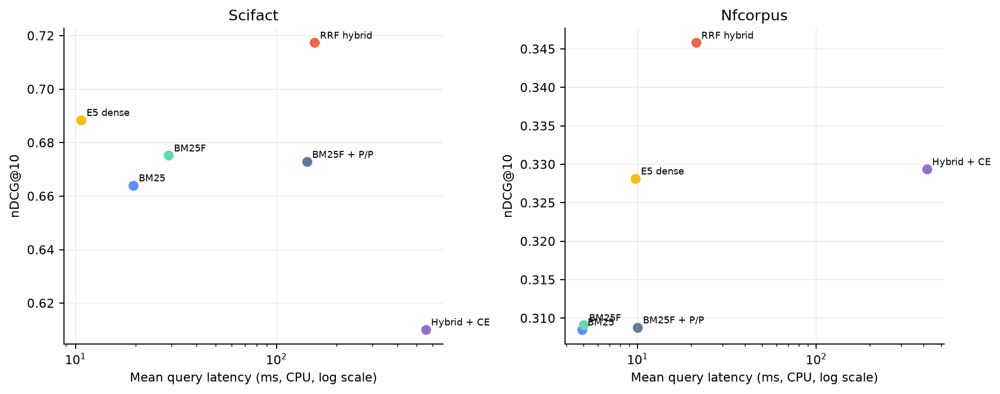

# Efficiency and Engineering Results

> **Post-Course Independent Retrieval Research Extension — 2026**

All timings were collected in one CPU-only environment: Windows 11, AMD Ryzen 9 9900X (12 cores / 24 logical), 128 GB RAM, Python 3.12.13 and PyTorch 2.13.0+cpu. The installed RTX 5090 was not used. Values are wall-clock measurements and should not be compared with external GPU benchmarks.

## Index construction, storage and memory

| Dataset | Lexical build | Lexical index | Lexical RSS increase | E5 document encoding | Throughput | Dense index | Dense-stage RSS increase |
|---|---:|---:|---:|---:|---:|---:|---:|
| SciFact | 2.136 s | 24.56 MB | 278.77 MB | 194.54 s | 26.64 docs/s | 7.39 MB | 565.94 MB |
| NFCorpus | 1.432 s | 18.49 MB | 210.39 MB | 147.77 s | 24.59 docs/s | 5.16 MB | 432.02 MB |

The dense matrix is compact because it stores one float32 384-vector per document and is compressed on disk. The lexical index is larger because it stores vocabulary, document IDs, field-separated term frequencies and complete positions.

E5 cold model loading took 7.37–7.88 seconds inside the benchmark process. A separate same-environment cold cross-encoder load took 7.25 seconds and increased RSS by 392.80 MB. In the full run, reranker model loading was about one second because PyTorch/Sentence Transformers were already resident. RSS deltas are process-level increments, not isolated model allocations.

## Online query latency

### SciFact

| Stage | Mean ms | p50 ms | p95 ms | Note |
|---|---:|---:|---:|---|
| BM25 | 19.41 | 15.83 | 35.81 | depth 1,000 |
| BM25F | 29.05 | 24.13 | 50.39 | field-aware |
| BM25F + phrase/proximity | 141.60 | 95.66 | 418.75 | positional pair work grows with long claims |
| E5 dense | 10.67 | 10.56 | 12.32 | one query encoding + exact matrix search |
| RRF fusion only | 2.56 | 1.36 | 1.53 | rare outliers lift the mean |
| **Hybrid end to end** | **154.83** | — | — | lexical + dense + fusion, serial sum |
| Lexical rerank stage | 393.91 | 393.17 | 409.68 | top 50 |
| Dense rerank stage | 395.84 | 396.08 | 411.58 | top 50 |
| Hybrid rerank stage | 398.43 | 399.47 | 411.33 | top 50 |
| **Hybrid + rerank end to end** | **553.26** | — | — | serial hybrid estimate + measured rerank |

### NFCorpus

| Stage | Mean ms | p50 ms | p95 ms | Note |
|---|---:|---:|---:|---|
| BM25 | 4.90 | 1.14 | 13.89 | query-length variation |
| BM25F | 4.99 | 1.09 | 14.37 | field-aware |
| BM25F + phrase/proximity | 10.00 | 1.68 | 39.86 | most queries are short |
| E5 dense | 9.75 | 8.81 | 10.57 | one query encoding + exact search |
| RRF fusion only | 1.47 | 0.70 | 1.05 | rare outliers lift the mean |
| **Hybrid end to end** | **21.22** | — | — | serial sum |
| Lexical rerank stage | 280.69 | 389.27 | 404.53 | some lexical queries return fewer than 50 candidates |
| Dense rerank stage | 391.48 | 392.88 | 407.76 | top 50 |
| Hybrid rerank stage | 393.83 | 392.53 | 414.49 | top 50 |
| **Hybrid + rerank end to end** | **415.05** | — | — | serial hybrid estimate + measured rerank |

End-to-end hybrid p50/p95 are intentionally omitted: adding independently measured percentiles would be mathematically invalid. The reproduction artefact retains each component’s full summary.

## Quality–cost interpretation

- **BM25/BM25F:** cheapest to build, easy to inspect, no pretrained model or embedding cache. BM25F’s added field logic costs little on NFCorpus and about 10 ms/query on long SciFact claims.
- **Phrase/proximity:** high transparency but unexpectedly expensive in the pure-Python research implementation. It adds roughly 112.6 ms mean latency on SciFact while slightly reducing quality.
- **Dense:** one-time CPU encoding costs 2.5–3.2 minutes, but exact query-time search is 9.8–10.7 ms and its index is smaller than the positional index at these scales.
- **RRF hybrid:** adds little fusion overhead and produces the best quality, but serial execution inherits both first-stage costs. Parallel first stages could lower latency, but were not measured and are not claimed.
- **Cross-encoder:** dominates online latency at roughly 0.39–0.40 seconds for 50 candidates, adds model memory/complexity, and reduces the best hybrid on both datasets. It is outside the observed quality–latency frontier.
- **Interpretability:** lexical scores and dependence evidence can be traced to terms/positions; E5 and cross-encoder decisions cannot be decomposed comparably. RRF remains interpretable at the rank-combination level.

The practical result is not “dense is always expensive.” On these small collections, offline embedding is the main dense cost; query-time E5 exact search can be cheaper than an unoptimised positional dependence scorer. Corpus scale and ANN choice would change that conclusion.

## Timing caveats

- The first query is warmed for retrieval timing, but model loading is recorded separately.
- Windows scheduler, CPU frequency, background load and model-cache state introduce noise.
- Dense and lexical indexes use different compression/serialization, so disk sizes are engineering artefact sizes rather than theoretical lower bounds.
- No energy measurement was available.
- No GPU/CPU comparison was attempted.
- Reranker maximum length is 512 tokens; latency and quality would change with different truncation or batching.
