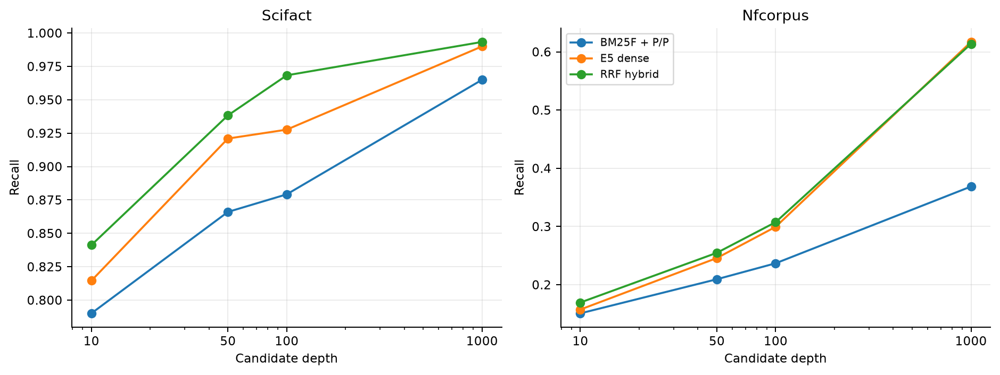
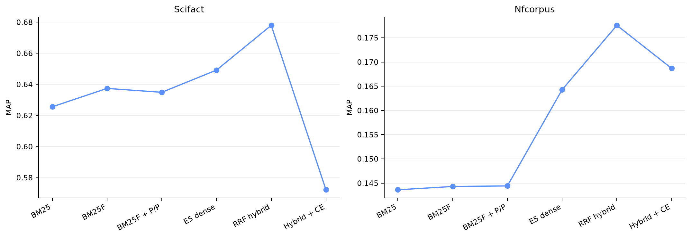

# Extension Results

> **Post-Course Independent Retrieval Research Extension — 2026**
>
> These are new public-benchmark results. They are not Robust04 results and were not part of the MSc team coursework.

## Headline outcome

Across both frozen test runs, exact E5 retrieval adds recall that the lexical index misses, and rank-only RRF turns that complementarity into the strongest overall quality. BM25F remains competitive, particularly on SciFact. Phrase/proximity does not reproduce the historical Robust04 gain. The cross-encoder is not a universal improvement: it fails badly on SciFact and reduces the strongest NFCorpus hybrid.

## SciFact test — 5,183 documents, 300 queries

| System | MAP | nDCG@10 | P@10 | Recall@100 | Recall@1000 | MRR | R-Precision |
|---|---:|---:|---:|---:|---:|---:|---:|
| BM25 | 0.6256 | 0.6641 | 0.0867 | 0.8826 | 0.9650 | 0.6370 | 0.5348 |
| BM25F | 0.6374 | 0.6752 | 0.0873 | 0.8859 | 0.9650 | 0.6496 | 0.5582 |
| BM25F + phrase/proximity | 0.6349 | 0.6729 | 0.0870 | 0.8792 | 0.9650 | 0.6480 | 0.5482 |
| E5 dense | 0.6492 | 0.6885 | 0.0920 | 0.9277 | 0.9900 | 0.6629 | 0.5637 |
| **RRF hybrid** | **0.6780** | **0.7174** | **0.0943** | **0.9683** | **0.9933** | **0.6900** | **0.5913** |
| Lexical + cross-encoder | 0.5662 | 0.6050 | 0.0830 | 0.8792 | 0.9650 | 0.5745 | 0.4837 |
| Dense + cross-encoder | 0.5908 | 0.6327 | 0.0880 | 0.9277 | 0.9900 | 0.5975 | 0.5005 |
| Hybrid + cross-encoder | 0.5722 | 0.6102 | 0.0847 | 0.9683 | 0.9933 | 0.5787 | 0.4832 |

The small P@10 scale reflects SciFact’s approximately 1.13 positive judgments per query; it is not directly comparable to Robust04 P@10.

## NFCorpus test — 3,633 documents, 323 queries

| System | MAP | nDCG@10 | P@10 | Recall@100 | Recall@1000 | MRR | R-Precision |
|---|---:|---:|---:|---:|---:|---:|---:|
| BM25 | 0.1436 | 0.3085 | 0.2164 | 0.2359 | 0.3683 | 0.5226 | 0.1688 |
| BM25F | 0.1443 | 0.3091 | 0.2164 | 0.2360 | 0.3678 | 0.5214 | 0.1725 |
| BM25F + phrase/proximity | 0.1444 | 0.3088 | 0.2155 | 0.2369 | 0.3687 | 0.5210 | 0.1737 |
| E5 dense | 0.1643 | 0.3282 | 0.2415 | 0.2995 | **0.6171** | 0.5261 | 0.1844 |
| **RRF hybrid** | **0.1776** | **0.3458** | **0.2495** | **0.3075** | 0.6137 | **0.5608** | **0.2045** |
| Lexical + cross-encoder | 0.1501 | 0.3231 | 0.2266 | 0.2369 | 0.3687 | 0.5333 | 0.1757 |
| Dense + cross-encoder | 0.1643 | 0.3235 | 0.2337 | 0.2995 | **0.6171** | 0.5245 | 0.1922 |
| Hybrid + cross-encoder | 0.1687 | 0.3294 | 0.2387 | **0.3075** | 0.6137 | 0.5299 | 0.1963 |

The dense run retains marginally more relevant material at depth 1,000 than the hybrid because RRF’s fused top 1,000 can crowd out a few dense-only tail documents. At practically important depths 10–100, hybrid recall is higher.

## Candidate recall and reranking ceiling

| Dataset / source | Recall@10 | Recall@50 | Recall@100 | Recall@1000 |
|---|---:|---:|---:|---:|
| SciFact lexical | 0.7901 | 0.8661 | 0.8792 | 0.9650 |
| SciFact dense | 0.8146 | 0.9210 | 0.9277 | 0.9900 |
| SciFact hybrid | **0.8412** | **0.9383** | **0.9683** | **0.9933** |
| NFCorpus lexical | 0.1509 | 0.2095 | 0.2369 | 0.3687 |
| NFCorpus dense | 0.1574 | 0.2459 | 0.2995 | **0.6171** |
| NFCorpus hybrid | **0.1695** | **0.2549** | **0.3075** | 0.6137 |

Reranking reorders only the top 50, so Recall@50/100/1000 is exactly preserved from each source. The high SciFact hybrid Recall@50 (0.9383) rules out an inadequate candidate set as the main explanation for the reranker’s large quality loss. Instead, likely contributors are MS MARCO domain mismatch, negation/claim-verification semantics, 512-token truncation, and title/body formatting. These are hypotheses, not post-hoc retuning instructions.

## Paired test comparisons

### SciFact

| Stage change | ΔMAP | 95% bootstrap CI | Two-sided p | AP wins/losses/ties | Interpretation |
|---|---:|---:|---:|---:|---|
| BM25 → BM25F | +0.0118 | [0.0016, 0.0230] | 0.0311 | 41 / 42 / 217 | small consistent aggregate gain |
| BM25F → phrase/proximity | -0.0025 | [-0.0124, 0.0069] | 0.6253 | 34 / 47 / 219 | uncertain; no transfer of historical gain |
| Lexical → dense | +0.0143 | [-0.0252, 0.0542] | 0.4815 | 94 / 70 / 136 | aggregate gain is uncertain |
| Lexical → hybrid | **+0.0431** | **[0.0194, 0.0667]** | **0.0004** | 106 / 30 / 164 | consistent complementary gain |
| Lexical → lexical rerank | -0.0687 | [-0.1000, -0.0386] | 0.00005 | 44 / 81 / 175 | reliable degradation |
| Dense → dense rerank | -0.0584 | [-0.0962, -0.0212] | 0.0025 | 58 / 89 / 153 | reliable degradation |
| Hybrid → hybrid rerank | **-0.1058** | **[-0.1396, -0.0737]** | **0.00005** | 28 / 114 / 158 | largest degradation |

For hybrid versus lexical, ΔnDCG@10 is +0.0446 with CI [0.0222, 0.0668]. The paired AP effect size is modest (dz 0.203), so the gain is meaningful but heterogeneous rather than universal.

### NFCorpus

| Stage change | ΔMAP | 95% bootstrap CI | Two-sided p | AP wins/losses/ties | Interpretation |
|---|---:|---:|---:|---:|---|
| BM25 → BM25F | +0.0007 | [-0.0006, 0.0021] | 0.3335 | 110 / 95 / 118 | negligible/uncertain |
| BM25F → phrase/proximity | +0.0001 | [-0.0012, 0.0016] | 0.8791 | 58 / 72 / 193 | negligible/uncertain |
| Lexical → dense | +0.0199 | [0.0078, 0.0317] | 0.0012 | 212 / 87 / 24 | consistent MAP gain |
| Lexical → hybrid | **+0.0331** | **[0.0260, 0.0406]** | **0.00005** | 256 / 38 / 29 | strongest consistent gain |
| Lexical → lexical rerank | +0.0056 | [-0.0006, 0.0122] | 0.0917 | 105 / 86 / 132 | MAP uncertain; nDCG improves |
| Dense → dense rerank | -0.00001 | [-0.0083, 0.0087] | 0.9983 | 119 / 112 / 92 | no MAP effect |
| Hybrid → hybrid rerank | -0.0089 | [-0.0152, -0.0029] | 0.0046 | 90 / 141 / 92 | reliable degradation |

Dense versus lexical nDCG@10 remains uncertain: Δ +0.0194, CI [-0.0010, 0.0395]. Hybrid is clearer: ΔnDCG@10 +0.0370, CI [0.0241, 0.0501]. The hybrid-versus-lexical AP effect size is moderate (dz 0.487).

## Controlled ladder

1. BM25 establishes a transparent lexical floor.
2. BM25F helps clearly on SciFact and minimally on NFCorpus.
3. Active phrase/proximity is neutral-to-negative, despite its historical Robust04 success.
4. Dense retrieval raises semantic recall and aggregate quality.
5. RRF converts complementary evidence into the strongest result on both datasets.
6. Cross-encoder reranking is not robust: it is harmful on SciFact and erodes the best NFCorpus run.

This supports the research framing rather than a “neural always wins” narrative. The strongest conclusion is about complementarity and cost, not model supremacy.
