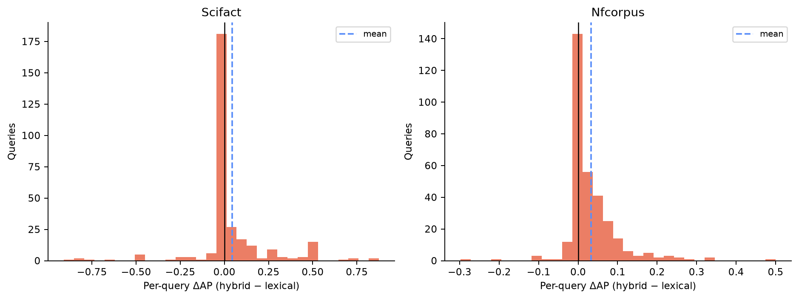
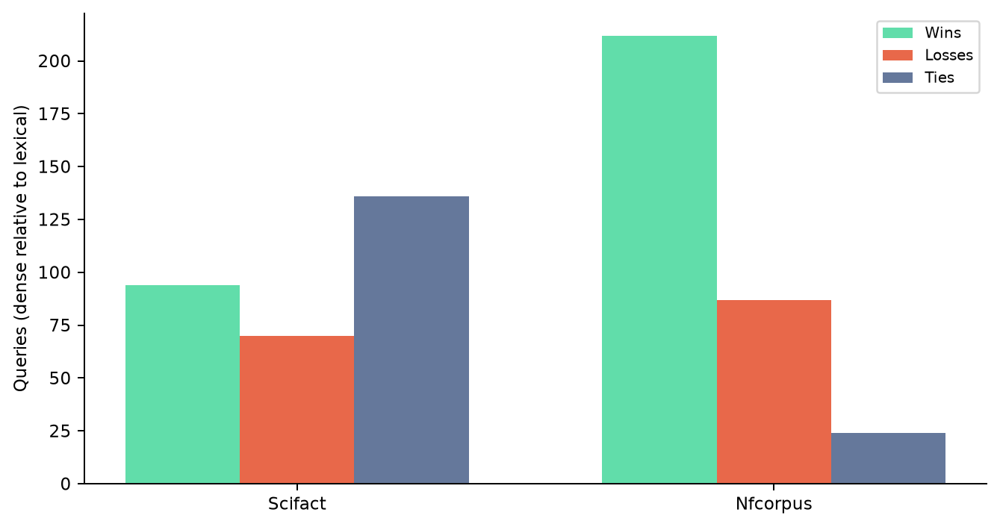

# Query-Level Analysis

> **Post-Course Independent Retrieval Research Extension — 2026**

Aggregate metrics hide a large number of ties and a smaller number of high-impact wins/losses. Categories below were rule-defined before test evaluation and overlap; they are descriptive, not independent statistical strata.

## Direct dense-versus-lexical outcomes

| Dataset | Dense AP wins | Dense AP losses | Ties | Mean ΔAP | 95% CI |
|---|---:|---:|---:|---:|---:|
| SciFact | 94 | 70 | 136 | +0.0143 | [-0.0252, 0.0542] |
| NFCorpus | 212 | 87 | 24 | +0.0199 | [0.0078, 0.0317] |

SciFact’s dense aggregate gain is driven by a minority of queries and is statistically uncertain. NFCorpus shows a much broader dense advantage. This is the first indication that semantic retrieval’s benefit depends on task/query distribution rather than simply model modernity.

## Hybrid-versus-lexical slices

### SciFact

| Objective slice | Queries | Hybrid wins | Losses | Ties | Mean ΔAP |
|---|---:|---:|---:|---:|---:|
| Short (≤5 tokens) | 10 | 2 | 1 | 7 | +0.0010 |
| Medium (6–9) | 76 | 27 | 8 | 41 | +0.0678 |
| Long (≥10) | 214 | 77 | 21 | 116 | +0.0362 |
| Named-entity-heavy | 32 | 11 | 2 | 19 | +0.0346 |
| Rare/OOV term | 290 | 99 | 29 | 162 | +0.0416 |
| Strong lexical/dense disagreement | 178 | 66 | 20 | 92 | +0.0466 |
| Phrase/proximity-sensitive | 282 | 102 | 30 | 150 | +0.0450 |

Only ten SciFact claims are short, so no conclusion should be drawn from that slice. Medium/long and disagreement-heavy claims show the clearest hybrid gains, consistent with dense recall helping when exact term evidence is insufficient. High tie counts reflect SciFact’s sparse qrels and single/few relevant abstracts.

### NFCorpus

| Objective slice | Queries | Hybrid wins | Losses | Ties | Mean ΔAP |
|---|---:|---:|---:|---:|---:|
| Short (≤5 tokens) | 258 | 205 | 28 | 25 | +0.0326 |
| Medium (6–9) | 59 | 47 | 9 | 3 | +0.0348 |
| Long (≥10) | 6 | 4 | 1 | 1 | +0.0385 |
| Named-entity-heavy | 144 | 111 | 28 | 5 | +0.0302 |
| Rare/OOV term | 281 | 216 | 36 | 29 | +0.0303 |
| Strong lexical/dense disagreement | 197 | 151 | 22 | 24 | +0.0294 |
| Phrase/proximity-sensitive | 133 | 108 | 19 | 6 | +0.0347 |

NFCorpus is dominated by short, natural-language nutrition queries. Hybrid gains are broad rather than isolated to one category, and disagreement-heavy queries still improve on average. The named-entity heuristic is noisy on title-cased NFCorpus queries and should not be read as a reliable NER system.

## Representative SciFact claims

SciFact claims/annotations are explicitly licensed for attribution by the official dataset. Examples are selected by largest absolute hybrid-minus-lexical AP delta, not by narrative preference.

| Query ID | Claim | Labels | ΔAP | Interpretation |
|---|---|---|---:|---|
| 72 | “Activator-inhibitor pairs are provided dorsally by Admpchordin.” | medium, rare/OOV, strong disagreement | +0.8750 | Dense evidence helps despite specialised/possibly malformed terminology; fusion retains exact matches. |
| 575 | “In domesticated populations of Saccharomyces cerevisiae, whole chromosome aneuploidy is very uncommon.” | long, rare/OOV, strong disagreement | +0.8571 | Semantic and lexical evidence are complementary for a long technical claim. |
| 1319 | “Transplanted human glial cells can differentiate within the host animal.” | long, rare/OOV, strong disagreement | +0.7500 | Dense retrieval supplies a large relevant-document ordering gain. |
| 1363 | “Venules have a thinner or absent smooth layer compared to arterioles.” | long, rare/OOV, strong disagreement | -0.9091 | Semantic retrieval can strongly misorder a precise comparative anatomy claim. |
| 674 | “LDL cholesterol has no involvement in the development of cardiovascular disease.” | long, rare/OOV | -0.8333 | Negation is a plausible failure mode: semantic similarity can retrieve topically related evidence without preserving claim polarity. |
| 294 | “Crossover hot spots are not found within gene promoters in Saccharomyces cerevisiae.” | long, rare/OOV, strong disagreement | -0.8000 | Another large loss involving negation and exact biological relations. |

The negation interpretation is an inference from query wording and ranking deltas; confirming it would require document-level error annotation, which was not added post hoc.

## Representative NFCorpus queries

| Query ID | Query | Labels | ΔAP | Interpretation |
|---|---|---|---:|---|
| PLAIN-307 | “Vitamin D: Shedding some light on the new recommendations” | medium, entity-heavy, rare/OOV, strong disagreement | +0.5000 | Natural paraphrase/semantic recall dominates exact overlap. |
| PLAIN-882 | “Chernobyl” | short, rare/OOV, strong disagreement | +0.3421 | Dense evidence broadens a one-word topic query. |
| PLAIN-3292 | “Are Multivitamins Good For You?” | short, entity-heavy, rare/OOV | +0.3220 | Conversational wording benefits from semantic matching. |
| PLAIN-2540 | “Does Cholesterol Size Matter?” | short, entity-heavy, rare/OOV, strong disagreement | +0.2698 | The dense component connects a question to relevant biomedical terminology. |
| PLAIN-1320 | “Harvard Physicians’ Study II” | short, entity-heavy, rare/OOV, strong disagreement | -0.2978 | A specific study name is a case where exact lexical/entity matching is valuable and semantic drift can hurt. |

## What the slices support

- **Semantic recall:** strongest and most consistent on NFCorpus’s natural-language queries.
- **Lexical precision:** still protects exact study/entity and relation-heavy queries.
- **Phrase/proximity:** changes many SciFact top-10 orders but does not improve aggregate quality; sensitivity is not the same as usefulness.
- **Disagreement:** low lexical/dense overlap is fertile ground for hybrid gains, but it also contains the largest failures.
- **Reranking:** high candidate recall does not guarantee improvement; ordering semantics and domain alignment matter.

Future work should label negation, entity and relation types with an external or predeclared annotation protocol before running new systems, rather than refining slices against these test outcomes.
